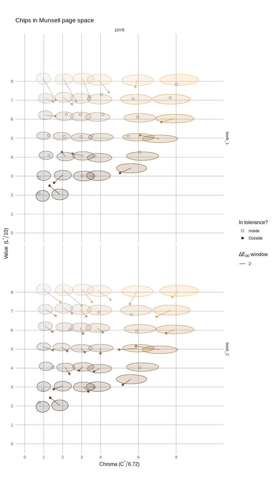

# munqc (Munsell Quality Control) package for R


The idea behind the munqc package was developed to help determine when
the UNL soil judging team should consider replacing their Munsell Soil
Color books. Since the experiment showed interesting results and plots,
munqc was developed so that other users of Munsell Soil Color books
could see how their books were standing the test of time.

## Installation

The stable version is not yet available on CRAN…

Development version:

``` r
remotes::install_github("asub-sandwich/munqc", build = FALSE)
```

## Examples

### Summary of scans and decisions

``` r
library(munqc)

# example data (the 22 original UNL soil judging team book scans)
data(example_scans)

# subset the data to only include books 1 and 2
x <- subset_ids(example_scans, c("book_1", "book_2"))

# compute the errors of the scanned books
x <- compute_error(x)

# print a summary assessment of your books
summary(x)
#> <ScanCollection QC summary>
#> Sensor:   veykolor
#> Decisive: matte  (other finishes reported but advisory)
#> 
#> Grade distribution
#>   imperceptible       12  (16.7%)
#>   perceptible         18  (25.0%)
#>   acceptable          21  (29.2%)
#>   marginal            16  (22.2%)
#>   replace              5  ( 6.9%)
#> 
#> By finish
#>  book_id    finish n_chips n_fail median_de p95_de max_de decisive
#>   book_1     gloss       5      0      1.86   3.83   4.11    FALSE
#>   book_1     matte      30      3      1.86   7.81   8.80     TRUE
#>   book_1 semigloss       1      0      1.37   1.37   1.37    FALSE
#>   book_2     gloss       5      0      1.83   3.47   3.66    FALSE
#>   book_2     matte      30      2      2.75   5.73   6.86     TRUE
#>   book_2 semigloss       1      0      2.06   2.06   2.06    FALSE
#> 
#> Verdict
#>  book_id n_judged n_fail fail_frac p95_de n_advisory_fail verdict
#>   book_1       30      3    0.1000   7.81               0 replace
#>   book_2       30      2    0.0667   5.73               0 replace
#> 
#> Flagged pages
#>  book_id  hue n_judged n_fail fail_frac p95_de worst_chip
#>   book_1 10YR       30      3    0.1000   7.81   10YR 8/1
#>   book_2 10YR       30      2    0.0667   5.73   10YR 8/2
```

### Scan plotting

``` r
library(munqc)

# example data (the 22 original UNL soil judging team book scans)
data(example_scans)

# subset the data to only include books 1 and 2
x <- subset_ids(example_scans, c("book_1", "book_2"))

# compute the errors of the scanned books
x <- compute_error(x, thresholds = munqc_thresholds(fail_at = 2))

# plotting the measured colors on a 'page-space' plot, with empirically-determined
# tolerance windows
plot(x, type = "page_space")
```



## Citation

``` r
citation("munqc")
#> To cite package 'munqc' in publications use:
#> 
#>   Subora A, Turk J (2026). _munqc: Munsell color book quality control_.
#>   R package version 0.0.0.9000.
#> 
#> A BibTeX entry for LaTeX users is
#> 
#>   @Manual{,
#>     title = {munqc: Munsell color book quality control},
#>     author = {Ada Subora and Judy Turk},
#>     year = {2026},
#>     note = {R package version 0.0.0.9000},
#>   }
```

## Related Papers

- Hopefully coming soon!

## Related Presentations

- Also hopefully coming soon!
